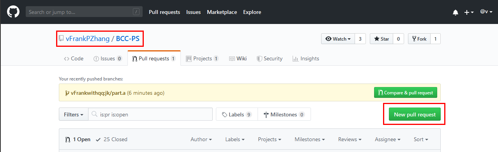
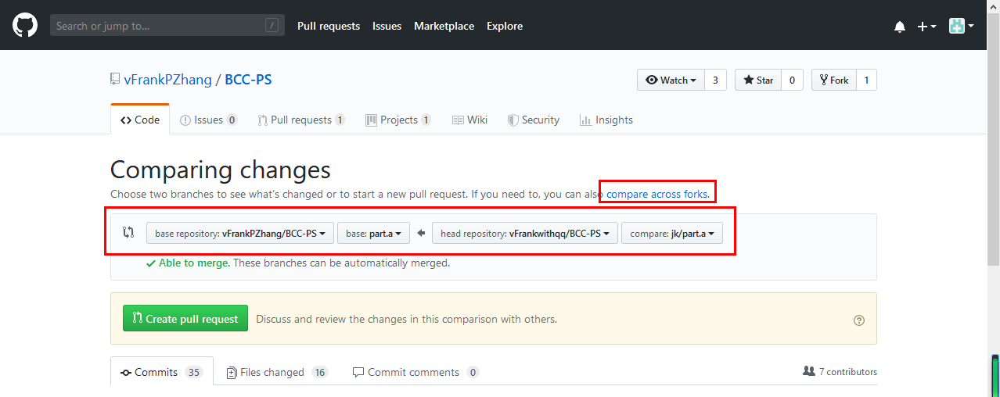
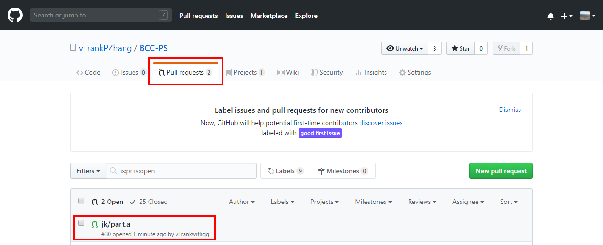
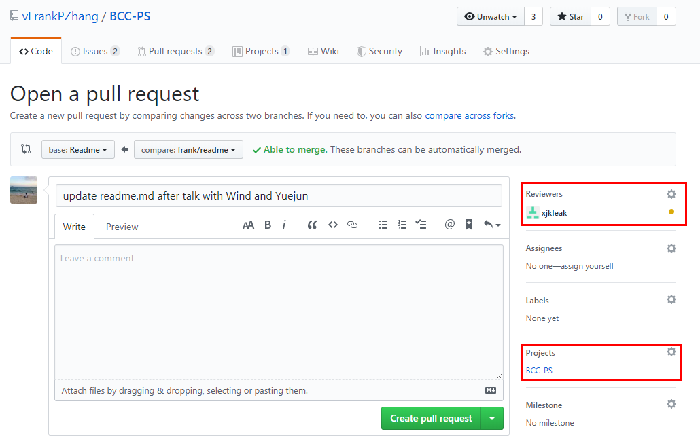
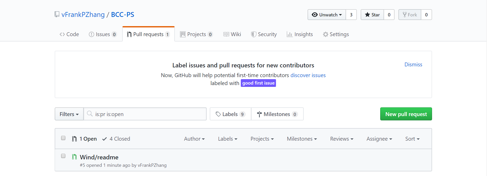
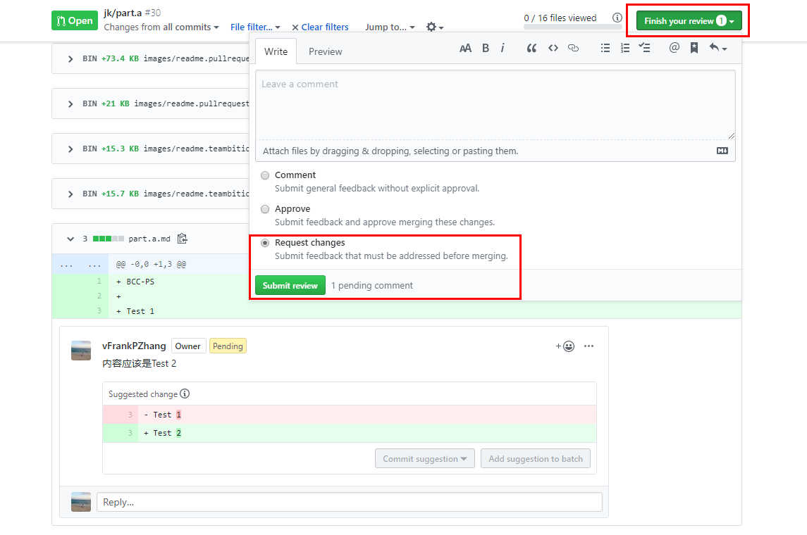

# 蓝云研究院技术认证——PowerShell

Blue Cloud Certified - PowerShell

# 学习材料

  文字稿  
  PPT  
  视频

# 准备工作
  
  1、注册Github个人账号  
  2、在本地安装Git和VS Code  
  3、将BCC-PS仓库克隆至自己的本地  
  ```powershell
  cd $home\documents
  git clone https://github.com/vFrankPZhang/BCC-PS.git BBC-PS
  ```

# 协作步骤

以Wind来完成readme内容的创作，其他人校对为例：

  1、Wind在自己的本地，将Git分支切换到readme分支  
  ```powershell
  PS >git checkout readme
  ```  
  2、基于readme分支创建自己的分支
  ```powershell
  PS >git checkout -b 'wind/readme'
  ```
  3、完成文档的创作
  4、将自己的分支push回Frank的Github
  ```powershell
  PS >git push origin wind/readme
  ```
  5、提交Pull Request到readme分支
  1）登录自己的Github帐号  
  2）用浏览器进入：https://github.com/vFrankPZhang/BCC-PS  
  3）点击“Pull requests”标签  
  
  4）点击“New pull request”按钮  
  
  5）选择清楚，pull request的方向，点击“Create new pull request”按钮，完成Pull request  
  
  6）填写说明，选择，需要帮你Review的人，然后点击“Create pull request”  
  
  7）此时，建坤在Pull request中找到Wind/readme的Pull request点开  
  
  8）点击Files changed，对内容进行校对  
  

直到最后讨论完成，由Frank进行Merge操作。

# 文字稿

## 文字稿的具体实施步骤

  1、章的划分、排序，每章目标的说明，及不同章的顺序的逻辑  
  2、根据确定的章，确定节的内容纲要  
  3、根据节的内容纲要确定内容的标准及要求，如：需要有知识讲解、截图、练习  
  4、分工开始具体写  
  5、完成文字稿工作

> ### 需要的背景知识
>
> PowerShell  
> Markdown  
> Git  
