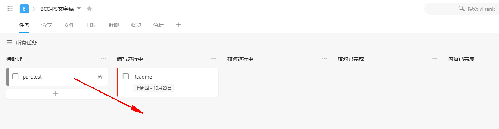

# 蓝云研究院技术认证——PowerShell

Blue Cloud Certified - PowerShell

# 我们要准备的学习材料包括

  文字稿  
  PPT  
  视频

# 需要的背景知识

PowerShell  
Markdown  
Git  

# 协作前的准备工作
  
  1、注册Github个人账号，将帐号发给Project Owner  
  2、注册Teambition帐号，将帐号发给Project Owner
  3、在本地安装Git和VS Code  
  4、将BCC-PS仓库克隆至自己的本地，命令如下：  
  ```powershell
  cd $home\documents  #切换到希望本地仓库所存放的路径
  git clone https://github.com/vFrankPZhang/BCC-PS.git BBC-PS
  ```

# 总体协作步骤

  1、依据确定好的章节，建立每章的Branch  
  2、每章的owner建立基于章节的Branch，建立以自己名字为前缀的Branch，在Teambition中，将任务状态移至“进行中”  
  3、每章的owner完成内容编写后，pull request回章节的Branch上，并进行merage，在Teambition中，将任务移至“校对进行中”开始校对工作  
  4、其他人为章节的Branch进行校对，完成后pull request回内容的Branch，直至校对完成后，章节Owner在Teambition中，将任务移至“内容已完成”  


# 参与者协作示例

假如，你现在是Part.Test章节的Owner
  

2.1 打开PowerShell，进入仓库“BBC-PS”所在的路径：
```powershell
PS > cd $home\document\BBC-PS
```
2.2 执行git pull，将本地的仓库更新至与远端一致
```powershell
PS > git pull
```
2.3 查看仓库中有哪些branch
```powershell
PS C:\Users\vFrank\Documents\BCC-PS> git branch -a
master
remotes/origin/HEAD -> origin/master
remotes/origin/master
remotes/origin/part.test
```
2.4 切换到part.test分支
```powershell
PS C:\Users\vFrank\Documents\BCC-PS> git checkout part.test
Switched to branch 'part.test'
```
2.5 创建以自己名字为前缀的part.test分支
```powershell
PS C:\Users\vFrank\Documents\BCC-PS> git checkout -b you/part.test
Switched to a new branch 'you/part.test'
```
2.6 在Teambition中将任务从“待处理”移至“编写进行中”


3.1 编写内容
比如你在you/part.test中，新建一个test.md的文件，内容为test,并保存文件
3.2 将文件提交给git来管理
```powershell
git add .
git commit -m 'add test.md'
```
3.3 将you/part.test分支推送到Frank's的github上
```powershell
git push
```
这时，Frank的github上就会有了you/part.test这个分支


3.4 将你的分支you/part.test pull request 给part.test


# 文字稿

## 完成文字稿的具体步骤

  1、章的划分、排序，每章目标的说明，及不同章的顺序的逻辑  
  2、根据确定的章，确定节的内容纲要  
  3、根据节的内容纲要确定内容的标准及要求，如：需要有知识讲解、截图、练习  
  4、分工开始具体写  
  5、完成文字稿工作


