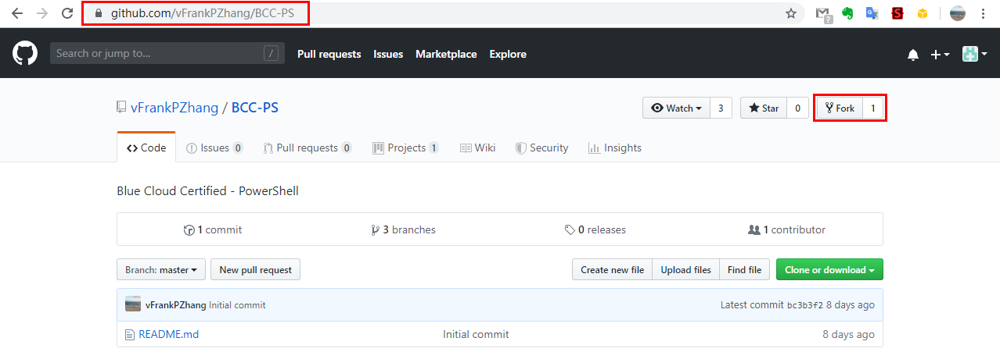
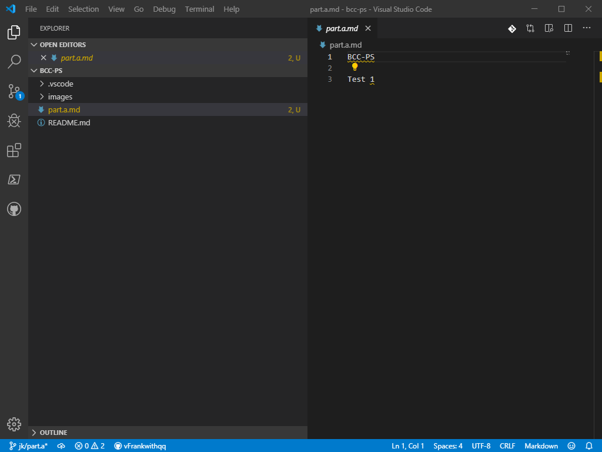
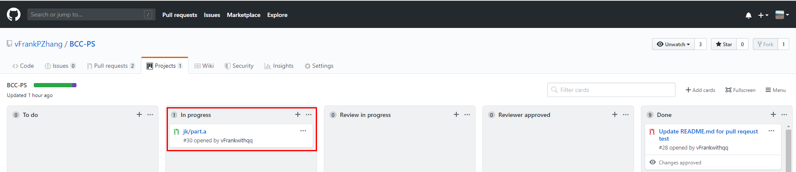
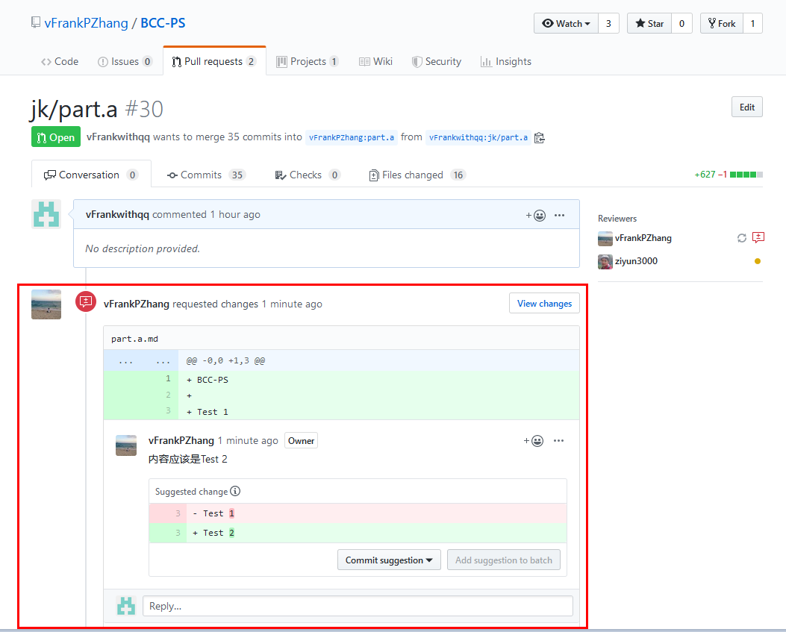
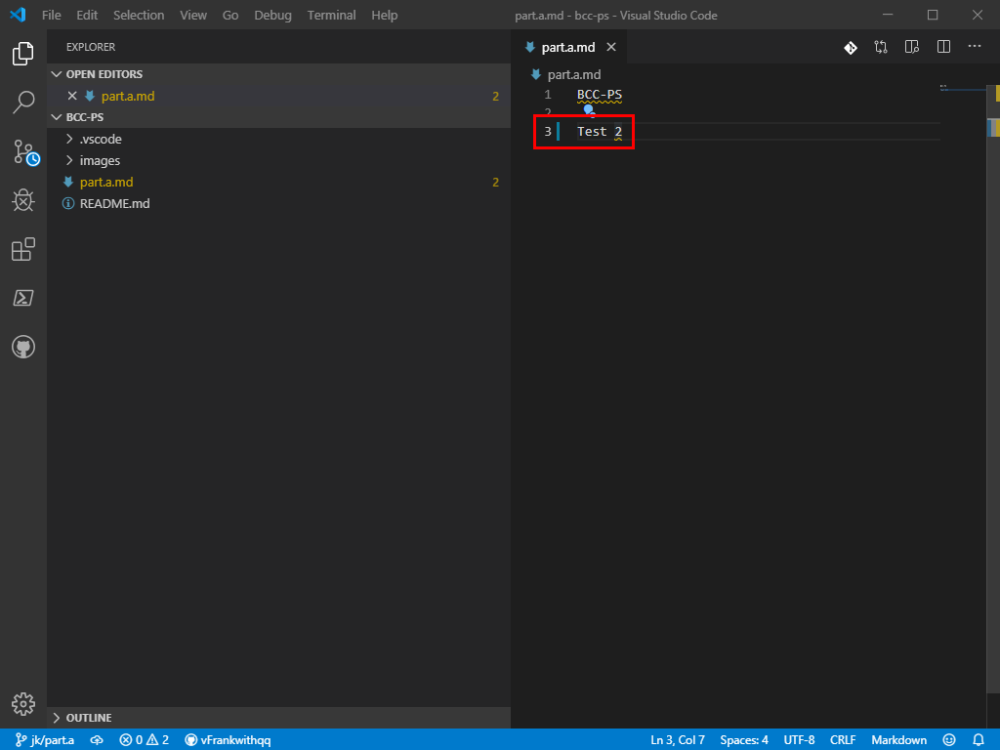
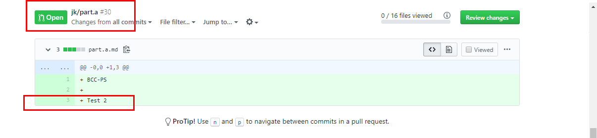
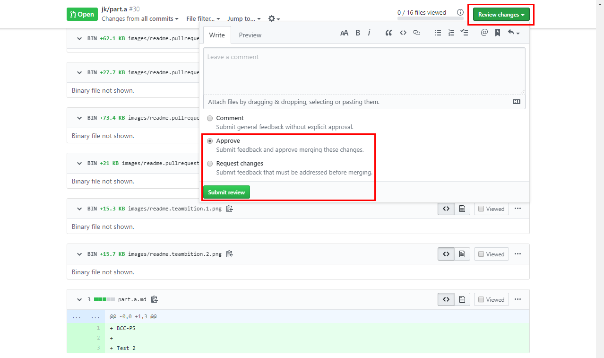
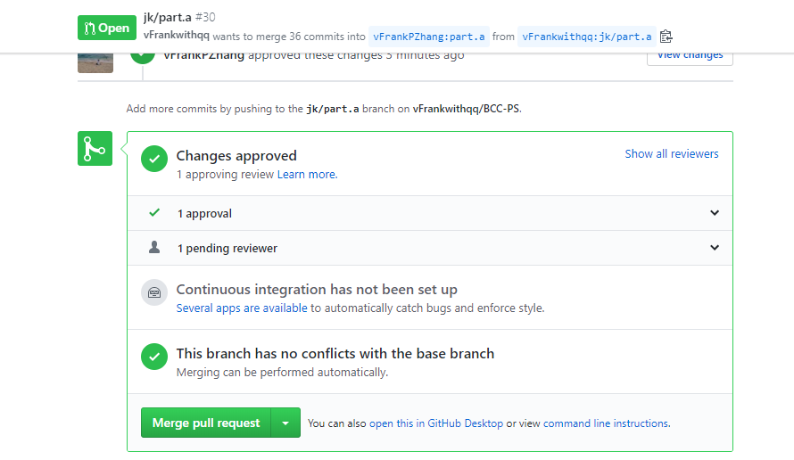

# 蓝云研究院技术认证——PowerShell

Blue Cloud Certified - PowerShell

## 我们要准备的认证培训材料包括

文字稿  
PPT  
视频

我们通过Git/Github进行认证培训材料的协作编辑。

## 需要的背景知识

PowerShell  
Markdown  
Git
VS Code

## 总体协作步骤

### 角色划分及职责

项目Owner：对章节进行划分、Merge章节"Branch";  
参与者：编写章节内容，提交章节"Branch""Pull request"；  
校对者：校对章节内容，批准章节"Pull request"，Merge章节"Pull request"。  

### 协作步骤

1.项目Owner依据确定好的章节，建立章节"Branch"。例如：Branch："part.a"。  
2.参与者将项目仓库Fork到自己的Github上，并建立以自己名字为前缀的章节"Branch"编写内容。例如：Branch："you/part.a"
3.参与者完成内容编写后，将自己的章节"Branch""Pull request"到项目仓库上对应的章节"Branch"上。例如："you/part.a" --->"part.a"
4.校对者对参与者提交的"Pull request"进行校对，并在参与者提交的"Pull request"上对内容进行批注和与参与者沟通。
5.参与者重新完善章节内容后，校对者"Approve"参与者提交的"Pull request"，由项目Owner对"Pull request"进行merge操作。

## 协作前的准备工作
  
1.注册Github个人账号
2.将项目的仓库Fork到自己的Github中  

项目仓库地址：https://github.com/vFrankPZhang/BCC-PS.git

通过浏览器进入到项目仓库，点击Fork，将该项目Fork到自己的Github中



3.在本地安装Git和VS Code  
4.将自己Github中Fork的本项目仓库克隆到本地  

```bash
git clone https://github.com/<your github>/BCC-PS.git BCC-PS
```

## 协作详细示例

> 项目Owner：Frank  
> 参与者：Jk  
> 校对者：Wind  
> 章节Branch：part.a  

* 准备阶段
* 编辑阶段
* 校对阶段
* 改进阶段
* 完成校对

### 准备阶段

1.Jk将Frank Github上的仓库"BCC-PS""Fork"至自己的Github帐户中;  
2.Jk将自己Github上"Fork"的仓库"BCC-PS"克隆至自己的计算机本地;

```powershell
PS C:\Windows\system32> cd $home\documents  #切换到希望本地仓库所存放的路径
PS C:\Users\Jk\Documents> git clone https://github.com/<your github>/BCC-PS.git BCC-PS
```

3.Jk在Git中切换到自己需要编辑的"Branch";

```powershell
PS C:\Users\Jk\Documents\BCC-PS> git checkout part.a
```

4.Jk建立以自己名字作为前缀的“part.a”分支；

```powershell
PS C:\Users\Jk\Documents\BCC-PS> git checkout -b jk/part.a
```

### 编辑阶段

1.Jk在VS Code中打开计算机本地从自己Github上克隆下来的BCC-PS文件夹。

2.Jk编写文件，例如：通过VS Code在BCC-PS目录中新建一个Markdown文件，名为"part.a.md"，内容如下并保存。



3.Jk将"part.a.md"文件提交给git，以便推送到自己的github仓库中

```powershell
PS C:\Users\Jk\Documents\bcc-ps> git add part.a.md
PS C:\Users\Jk\Documents\bcc-ps> git commit -m 'add part.a.md'
[jk/part.a 9d3ce72] add part.a.md
 1 file changed, 3 insertions(+)
 create mode 100644 part.a.md
```

4.Jk将本地BCC-PS仓库中的内容推送至Github中

```powershell
PS C:\Users\Jk\Documents\BCC-PS> git push
Enumerating objects: 4, done.
Counting objects: 100% (4/4), done.
Delta compression using up to 4 threads
Compressing objects: 100% (2/2), done.
Writing objects: 100% (3/3), 284 bytes | 142.00 KiB/s, done.
Total 3 (delta 1), reused 0 (delta 0)
remote: Resolving deltas: 100% (1/1), completed with 1 local object.
remote: This repository moved. Please use the new location:
remote:   https://github.com/Jk/BCC-PS.git
remote:
remote: Create a pull request for 'jk/part.a' on GitHub by visiting:
remote:      https://github.com/Jk/BCC-PS/pull/new/jk/part.a
remote:
To https://github.com/jk/bcc-ps.git
 * [new branch]      jk/part.a -> jk/part.a
```

### 校对阶段

1.Jk将"jk/part.a"分支从自己的github上"Pull request"给Frank的github的"part.a"分支上


请注意选择好"Pull request"的方向，是从Jk:jk/part.a ---> Frank：part.a，然后点击绿色的"Create pull request"按钮  
如果没有出现截图中的选择框，请点击"compare across forks"


2.此时，Frank的Github上的BCC-PS仓库中的"Pull request"标签页，就会出现一个由Jk提交过来的"Pull request"


3.校对者Wind，点击Jk提交的"Pull request"的标题进入"Pull request"的详情页

4.Wind将该"Pull request"的Reviewers指定给Wind，将Projects指定给BCC-PS。这样，该"Pull request"就会被Github的Workflow自动追踪，其他人就可以在"Project"页面看到进度。




5.Wind点击"Pull request"标签页中的"Files Changed"查看Jk提交过来的内容，并进行批注。

如："part.a.md"文件中的第3行，应该将内容"Test 1"改"Test 2"，点击小红框，可以自动生成```suggestion```，可以将建议修改后的内容填入，批注完成，点击"Start a review"开始校对。


6.Wind完成全部校对后，点击"Finish your review"，选择"Request change"，要求Jk修改内容。


7.Jk可以在"Pull reqeust"中看到Wind的批注，可以与Wind进行内容的探讨。



## 改进阶段

1.Jk在VS Code中重新编辑内容


2.Jk重复编辑阶段的第3、4步

3.Jk修正后并重新Push到Jk Github的内容，会自动在"Pull request"中更新



## 完成校对

1.Wind确认修改后的内容，同意进行Merge后，点击"Review changes"，选择"Approve"并点击"Submit review"，完成Review工作。



2.Wind点击"Merge pull request"将"Approve"之后的"Pull request"合并到章节Branch"part.a"上。



## 关于文字稿

### 完成文字稿的具体步骤

1、章的划分、排序，每章目标的说明，及不同章的顺序的逻辑  
2、根据确定的章，确定节的内容纲要  
3、根据节的内容纲要确定内容的标准及要求，如：需要有知识解、截图、练习  
4、分工开始具体写  
5、完成文字稿工作
